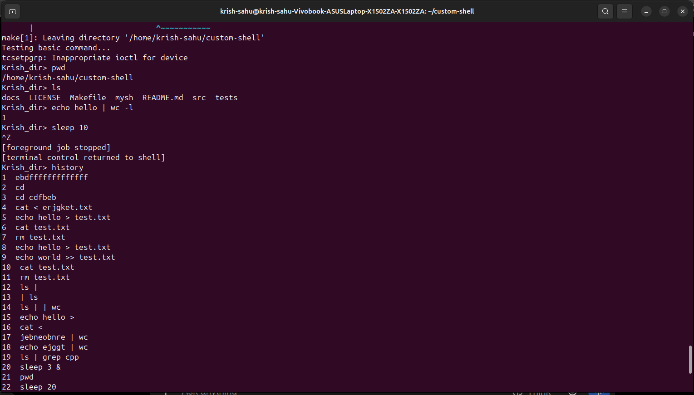

# Custom Unix-like Shell

A Unix-like command-line shell built from scratch in **C++** using Linux system calls and APIs.

This project was developed to understand how a shell works internally, including process creation, command execution, inter-process communication, I/O redirection, signals, process groups, terminal control, wildcard expansion, command history, file locking, and file signature scanning.

---

## 🚀 Features

### 1. Command Execution

Supports execution of standard Linux commands using:

- `fork()`
- `execvp()`
- `waitpid()`

Example:

```bash
mohanlal> ls
mohanlal> pwd
mohanlal> echo Hello

## Demo

